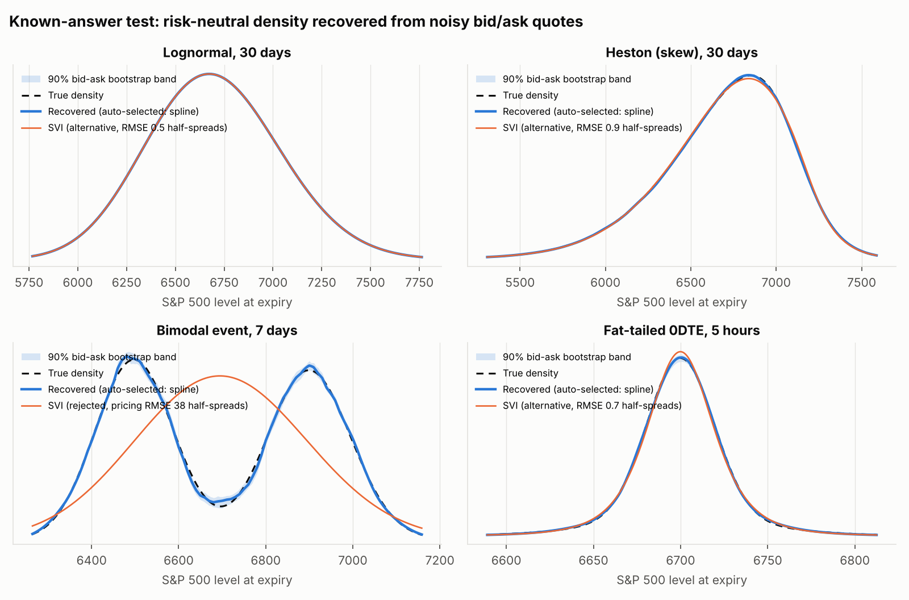
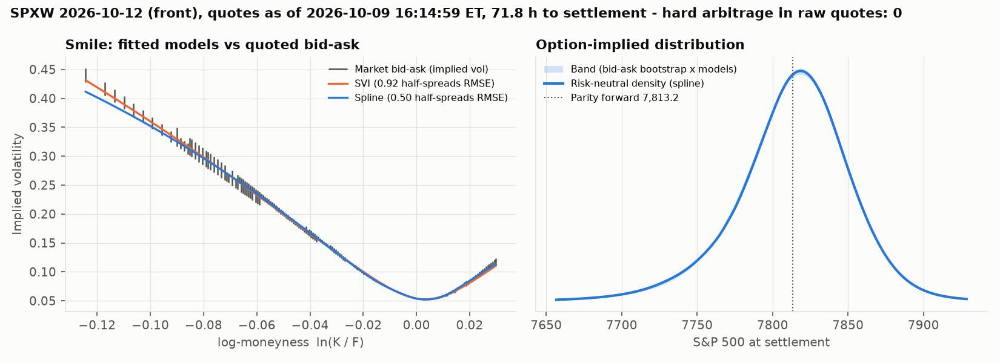

# option-implied-density

**Breeden-Litzenberger with error bars, plus a test that shows when those error bars are wrong.**



*Each panel is a world whose true density is known. The engine sees only realistic bid/ask quotes (SPX tick sizes, fair value placed randomly inside the spread, zero-bid wings) and has to recover the density. Bottom left: the parametric SVI smile cannot represent a bimodal event. Its pricing error (38 half-spreads) gives it away, and auto-selection switches to the spline.*

## Research at a glance

**Question.** Option prices contain the market's full probability distribution for the index, but quotes are noisy intervals. How accurately can that distribution be recovered, and can the error bars be trusted?

**Why it matters.** Everything built on option-implied probabilities inherits this error: tail-risk measures, event pricing, and cross-market comparisons such as [Kalshi vs options](https://github.com/japark22/kalshi-mispricing-engine). Most implementations take a second difference of mid prices and show one curve, with no uncertainty and no test against a known answer.

**What is different here**

1. **Validated against known answers.** Four synthetic markets with exact densities (lognormal, Heston skew, a bimodal FOMC-style event, fat-tailed 0DTE), quoted with SPX tick sizes, realistic spreads and zero-bid wings.
2. **Error bars that include model risk.** A bootstrap over the bid-ask reruns the *whole* pipeline. It is combined across two structurally different smile models, because one model's error bars can look tight and still be wrong.
3. **Fit measured in market units.** Pricing error is expressed in half-spreads, so "the model fits" means "the model price sits inside the quotes". Badly specified models are detected and rejected automatically.
4. **No hidden assumptions.** The forward and discount factor come from put-call parity, the density is analytic (no finite-difference step to tune), and AM- and PM-settled SPX options are kept apart.

**Findings** (every number comes from [`results/`](results/))

| Finding | Evidence |
|---|---|
| A single model's error bars can be confidently wrong | Under Heston, SVI's 90% band covers the true probability **5%** of the time; the combined band covers **91%** |
| Parametric smiles cannot see events | On a bimodal event SVI misplaces about 30% of the probability mass. It is flagged at **38 half-spreads** of pricing error, and the spline is chosen in **30 of 30** runs |
| Same-day (0DTE) options are the hard case, and the report says so | Band coverage falls to **61%**. The largest error left outside the band is **0.21 pp** per 25-point bucket, which the Kalshi project uses as an explicit tolerance |

**Skills shown:** derivatives pricing (Black-76, SVI, Heston), numerical methods, simulation design, statistical validation (PIT/Berkowitz, Diebold-Mariano), and tested, CI-checked Python.

---

## Why another Breeden-Litzenberger repo

Most implementations take a second difference of mid prices, plot one curve, and stop there. Three questions go unanswered:

1. **How uncertain is the curve?** A quote is an interval, not a number.
2. **How much of the curve is the smile model rather than the market?**
3. **Does the method work at all?** You can only tell by running it where the answer is known.

This repo answers all three. Every number below comes from `scripts/known_answer_study.py` and is stored in [`results/`](results/).

## What it does

| Step | Approach |
|---|---|
| Forward and discount factor | Put-call parity regression on near-ATM strikes, so no rate or dividend assumption is needed |
| Wing truncation | Stop after two consecutive zero bids (the Cboe VIX rule) |
| Smile | Two structurally different fitters: **SVI** (parametric) and a **penalised spline** whose penalty is set by the discrepancy principle. Both minimise pricing error measured in *half-spreads*. |
| Density | Analytic: $q(K) = g(k)\,\varphi(d_2)/(K\sqrt{w})$ via Gatheral's $g$. There are no finite differences and no step size to tune. |
| Error bars | Bid-ask bootstrap of the *entire* pipeline, combined across fitters that price the quotes |
| Diagnostics | Executable vs mid-only static arbitrage in raw quotes, negative density mass, tail mass, martingale error |
| Validation | PIT + Berkowitz test, Diebold-Mariano test, log/Brier scores, reliability tables |
| Data | Cboe public delayed-quote parser (**SPXW** PM-settled vs **SPX** AM-settled handled explicitly) and an EOD file loader |

## Results: the known-answer study

30 noise seeds per world, plus 12 bootstrap-coverage runs with 60 draws each. Bucket errors use 25-point S&P ranges, the width Kalshi lists. Coverage is measured on buckets with true probability above 1%.

| World | L1 density error | Bucket error, mean / mean-of-run-max (pp) | SVI band coverage | Combined band coverage |
|---|---|---|---|---|
| Lognormal, 30d | 0.0010 | 0.001 / 0.015 | 92% | **96%** |
| Heston skew, 30d | 0.0053 | 0.006 / 0.027 | **5%** | **91%** |
| Bimodal event, 7d | 0.0238 | 0.062 / 0.223 | rejected (RMSE 37.7 half-spreads) | 79% |
| Fat-tailed 0DTE, 5h | 0.0274 | 0.142 / 0.292 | 57% | **61%** |

The point estimates use auto-selection; full tables are in [`results/known_answer_summary.md`](results/known_answer_summary.md).

**What the study shows**

- **A misspecified model's error bars are useless.** On Heston, SVI fits the quotes well (RMSE 0.9 half-spreads), but its bootstrap band covers the true bucket probability only 5% of the time. Combining SVI with the spline restores 91% coverage.
- **SVI cannot see events.** On a bimodal distribution its L1 error is 0.59, meaning about 30% of the probability mass is in the wrong place. Measuring fit in half-spreads makes the failure obvious, so auto-selection picked the spline in 30 of 30 runs.
- **0DTE is the hard case, and the bands under-cover (61%).** The error left outside the band was at most 0.21 percentage points per 25-point bucket across the 12 runs, with 0.11 pp at the 90th percentile. This is the largest value observed, not a bound. [`kalshi-mispricing-engine`](https://github.com/japark22/kalshi-mispricing-engine) uses that maximum as an explicit model-error tolerance rather than pretending the band is exact. For scale, one Kalshi cent is 1 pp.
- **The parity forward is accurate to under a quarter of a basis point** (mean absolute error 0.04–0.23 bp), with no rate input. This is on synthetic chains where parity holds exactly up to quote noise. Expect larger errors on real chains, where quotes can be stale or crossed.

## Live: real SPXW chains

The same pipeline runs on the real market every trading day. A [GitHub Actions job](.github/workflows/live.yml) downloads Cboe's public delayed SPX chain near the close and fits two PM-settled expiries: the front expiry (0–1 day) and the one closest to a week out. It then appends the diagnostics to [`results/live/history.csv`](results/live/history.csv).



*Left: implied-vol bid-ask ranges from the market with both fitted smiles. Right: the risk-neutral density with its band. The title reports how many executable static-arbitrage violations exist in the raw quotes.*

Each row of the history records:

- the parity forward and discount factor;
- each model's pricing error in half-spreads, and the share of fitted prices inside the bid-ask;
- quantiles, skew and kurtosis of the density;
- the probability of a ±2% move, with its band;
- hard and soft arbitrage counts;
- negative mass, martingale error and bootstrap failures.

The fit uses the chain's **as-of time** (its newest trade), not the download time. Raw quotes are never stored.

## Quickstart

```bash
python3 -m venv .venv && source .venv/bin/activate
pip install -e ".[dev]"
pytest -q                                   # 27 tests, offline
python scripts/known_answer_study.py        # regenerates results/ (~10 min on 2 cores)
python scripts/live_fit.py                  # fit today's real SPXW chains (Cboe delayed quotes)
```

```python
from rnd import OptionChain, fit_rnd
from rnd.bootstrap import total_uncertainty

chain = OptionChain.from_frame(df, T=hours / (24 * 365))   # df: strike, cp, bid, ask
fit = fit_rnd(chain, method="auto")                        # svi | spline | auto
fit.rnd.prob_between(6700, 6724.9999)                      # P(range) under the risk-neutral measure
tu = total_uncertainty(chain, n_boot=100)
tu.prob_between(6700, 6724.9999)                           # (point, 5th pct, 95th pct)
print(fit.summary())                                       # F, DF, fit RMSE in half-spreads, tail mass, ...
```

## Limitations

- **Risk-neutral, not real-world.** The density is the market's risk-neutral distribution, not a forecast. The validation tools exist to measure that gap, not to hide it.
- **Synthetic microstructure.** The study's quotes are realistic but synthetic. Real chains have stale quotes, crossed markets and clustered strikes. The raw-quote arbitrage audit is there to catch these.
- **One expiry at a time.** There is no calendar-arbitrage enforcement across expiries.
- **Coverage numbers are a best case.** The bootstrap and the simulator share one noise model: fair value is uniform inside the spread and independent across strikes. Real quote errors are correlated and stale, so real-world coverage will be lower. A different smile family could also move the union band.
- **`auto` leans towards the spline.** It picks the lower in-sample pricing RMSE, and the spline is tuned to about 0.58 half-spreads by construction. It is a mild bias, but `model_spread` and the union band exist so you never rely on the choice alone.

## Layout

```
src/rnd/       black.py · chain.py (parity forward, OTM table) · smile.py (SVI, spline) · density.py (BL)
               bootstrap.py (quote + model uncertainty) · arbitrage.py · validation.py · synthetic.py · io/
scripts/       known_answer_study.py · live_fit.py · fit_cboe_snapshot.py
results/       study outputs (CSV, markdown, figure) and live/ real-chain fits - all generated
docs/          METHODOLOGY.md (derivations, design choices, references)
```

MIT licence.
